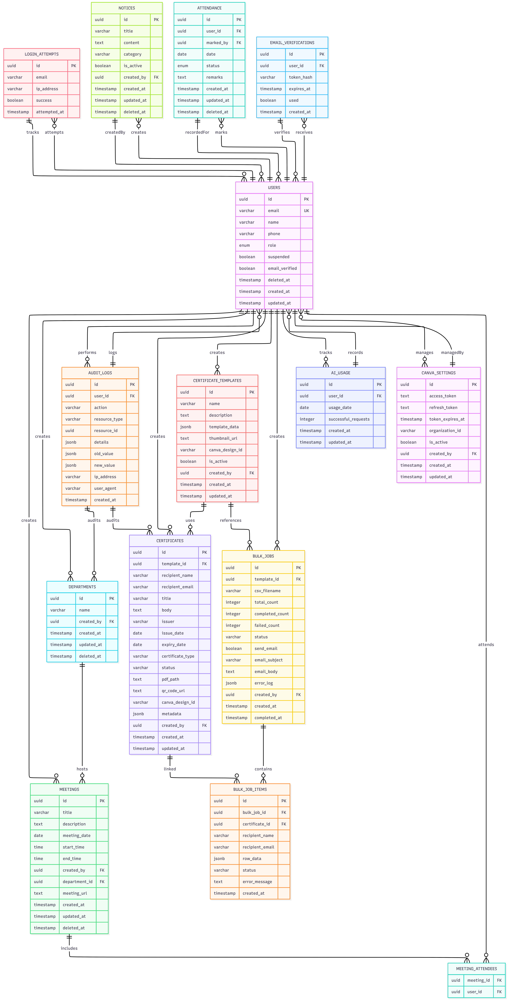

# Database Schema

This document provides an overview of the InternOps database schema after applying all migrations in the `backend/migrations` directory.

The project uses PostgreSQL with raw SQL migrations, UUID-based primary keys, soft deletes where applicable, and explicit foreign key constraints to maintain data integrity. This document provides a centralized reference for the current database schema generated from the project's SQL migrations.

It includes:

- Database overview
- Entity Relationship Diagram (ERD)
- Table definitions
- Foreign key relationships
- Indexes
- Enum types
- Maintenance guidelines

---

# Table of Contents

- [Database Schema](#database-schema)
- [Table of Contents](#table-of-contents)
  - [Database Overview](#database-overview)
  - [Entity Relationship Diagram](#entity-relationship-diagram)
  - [Schema Reference](#schema-reference)
  - [Tables](#tables)
    - [departments](#departments)
    - [users](#users)
    - [refresh\_tokens](#refresh_tokens)
    - [attendance](#attendance)
    - [ratings](#ratings)
    - [social\_tasks](#social_tasks)
    - [proof\_submissions](#proof_submissions)
    - [proof\_images](#proof_images)
    - [notifications](#notifications)
    - [audit\_logs](#audit_logs)
    - [login\_attempts](#login_attempts)
    - [meetings](#meetings)
    - [meeting\_attendees](#meeting_attendees)
    - [password\_reset\_tokens](#password_reset_tokens)
    - [email\_verifications](#email_verifications)
    - [task\_assignments](#task_assignments)
    - [password\_reset\_attempts](#password_reset_attempts)
    - [ai\_usage](#ai_usage)
    - [notices](#notices)
    - [certificate\_templates](#certificate_templates)
    - [certificates](#certificates)
    - [bulk\_jobs](#bulk_jobs)
    - [bulk\_job\_items](#bulk_job_items)
    - [canva\_settings](#canva_settings)
  - [Foreign Keys (Summary)](#foreign-keys-summary)
  - [Indexes (Summary)](#indexes-summary)
  - [Maintaining this Documentation](#maintaining-this-documentation)

## Database Overview

The InternOps database is designed around a user hierarchy and internship management workflow.

The core entities are:

- **Users** – Stores user accounts, authentication information, roles, and reporting hierarchy.
- **Departments** – Organizes users into departments and management structures.
- **Attendance & Ratings** – Tracks intern attendance and performance evaluations.
- **Meetings** – Manages department meetings and participant information.
- **Social Tasks & Proof Submissions** – Allows managers to assign engagement tasks and verify completed submissions.
- **Notifications & Audit Logs** – Records user notifications and security/audit events.
- **Authentication** – Supports refresh tokens, email verification, password resets, and login attempt tracking.
- **Certificates** – Handles certificate templates, generated certificates, bulk generation jobs, and Canva integration.
- **AI Usage** – Tracks AI feature usage for rate limiting and analytics.

All primary entities are connected using foreign key constraints to preserve referential integrity and support consistent application behavior.

---

## Entity Relationship Diagram

The diagram below provides a high-level visualization of the relationships between the primary database tables.

> **Note:** The ER diagram is intended for architectural understanding. For complete column definitions, constraints, indexes, and relationships, refer to the table documentation below.

---

## Schema Reference

The following sections document each table, including its columns, constraints, indexes, and relationships as defined by the latest database migrations.

## Tables

### departments
- `id` UUID PRIMARY KEY DEFAULT `uuid_generate_v4()`
- `name` VARCHAR(255) NOT NULL
- `created_by` UUID
- `created_at` TIMESTAMPTZ DEFAULT NOW()
- `updated_at` TIMESTAMPTZ DEFAULT NOW()
- `deleted_at` TIMESTAMPTZ

Constraints & Indexes:
- UNIQUE: `departments_name_unique` on `name`
- Partial unique index: `departments_name_active_idx` ON (name) WHERE deleted_at IS NULL

### users
- `id` UUID PRIMARY KEY DEFAULT `uuid_generate_v4()`
- `email` VARCHAR(255) NOT NULL
- `password_hash` VARCHAR(255) NOT NULL
- `role` user_role NOT NULL
- `manager_id` UUID REFERENCES `users`(id)
- `department_id` UUID REFERENCES `departments`(id) ON DELETE SET NULL
- `full_name` VARCHAR(255)
- `suspended` BOOLEAN DEFAULT FALSE
- `avatar_url` VARCHAR(500)
- `created_at` TIMESTAMPTZ DEFAULT NOW()
- `updated_at` TIMESTAMPTZ DEFAULT NOW()
- `deleted_at` TIMESTAMPTZ
- `email_verified` BOOLEAN DEFAULT FALSE

Constraints & Indexes:
- CHECK: `users_email_lowercase` CHECK (email = LOWER(email))
- UNIQUE (partial): `users_email_active_key` UNIQUE (LOWER(email)) WHERE deleted_at IS NULL
- UNIQUE: `users_email_lower_idx` UNIQUE (LOWER(email))
- Indexes: `idx_users_email`, `idx_users_role`, `idx_users_manager`, `idx_users_department`
- Trigger: `last_admin_guard` validates last active admin invariant

### refresh_tokens
- `id` UUID PRIMARY KEY DEFAULT `uuid_generate_v4()`
- `user_id` UUID NOT NULL REFERENCES users(id) ON DELETE CASCADE
- `token_hash` VARCHAR(255) NOT NULL UNIQUE
- `expires_at` TIMESTAMPTZ NOT NULL
- `revoked` BOOLEAN DEFAULT FALSE
- `created_at` TIMESTAMPTZ DEFAULT NOW()

Indexes:
- `idx_refresh_token_user` ON (user_id)

### attendance
- `id` UUID PRIMARY KEY DEFAULT `uuid_generate_v4()`
- `user_id` UUID NOT NULL REFERENCES users(id) ON DELETE CASCADE
- `marked_by` UUID NOT NULL REFERENCES users(id) ON DELETE CASCADE
- `date` DATE NOT NULL
- `status` attendance_status NOT NULL
- `remarks` TEXT
- `created_at` TIMESTAMPTZ DEFAULT NOW()
- `updated_at` TIMESTAMPTZ DEFAULT NOW()
- `deleted_at` TIMESTAMPTZ

Constraints & Indexes:
- UNIQUE(user_id, date)
- `idx_attendance_user_date` ON (user_id, date)
- `idx_attendance_marked_by` ON (marked_by)

### ratings
- `id` UUID PRIMARY KEY DEFAULT `uuid_generate_v4()`
- `rated_user_id` UUID NOT NULL REFERENCES users(id) ON DELETE CASCADE
- `rated_by` UUID NOT NULL REFERENCES users(id) ON DELETE CASCADE
- `score` INTEGER CHECK (score >= 1 AND score <= 10)
- `remarks` TEXT
- `created_at` TIMESTAMPTZ DEFAULT NOW()
- `updated_at` TIMESTAMPTZ DEFAULT NOW()
- `deleted_at` TIMESTAMPTZ

Indexes:
- `idx_ratings_rated_user` ON (rated_user_id)
- `idx_ratings_rated_by` ON (rated_by)

### social_tasks
- `id` UUID PRIMARY KEY DEFAULT `uuid_generate_v4()`
- `title` VARCHAR(255) NOT NULL
- `description` TEXT
- `target_platform` VARCHAR(100)
- `task_link` VARCHAR(500)
- `deadline` TIMESTAMPTZ
- `created_by` UUID NOT NULL REFERENCES users(id) ON DELETE CASCADE
- `created_at` TIMESTAMPTZ DEFAULT NOW()
- `updated_at` TIMESTAMPTZ DEFAULT NOW()
- `deleted_at` TIMESTAMPTZ
- `reminder_sent_at` TIMESTAMPTZ

Indexes:
- `idx_social_tasks_deadline` ON (deadline)
- `idx_social_tasks_deadline_reminder` ON (deadline) WHERE deadline IS NOT NULL AND reminder_sent_at IS NULL AND deleted_at IS NULL

### proof_submissions
- `id` UUID PRIMARY KEY DEFAULT `uuid_generate_v4()`
- `task_id` UUID NOT NULL REFERENCES social_tasks(id) ON DELETE CASCADE
- `intern_id` UUID NOT NULL REFERENCES users(id) ON DELETE CASCADE
- `image_path` VARCHAR(500)
- `verified_by` UUID REFERENCES users(id) ON DELETE SET NULL
- `verified_at` TIMESTAMPTZ
- `status` VARCHAR(20) DEFAULT 'PENDING'
- `did_comment` BOOLEAN DEFAULT FALSE
- `did_repost` BOOLEAN DEFAULT FALSE
- `did_share` BOOLEAN DEFAULT FALSE
- `created_at` TIMESTAMPTZ DEFAULT NOW()
- `updated_at` TIMESTAMPTZ DEFAULT NOW()
- `deleted_at` TIMESTAMPTZ

Indexes:
- `idx_proof_task` ON (task_id)
- `idx_proof_intern` ON (intern_id)

### proof_images
- `id` UUID PRIMARY KEY DEFAULT `gen_random_uuid()`
- `proof_id` UUID NOT NULL REFERENCES proof_submissions(id) ON DELETE CASCADE
- `image_path` TEXT NOT NULL
- `created_at` TIMESTAMPTZ DEFAULT NOW()

### notifications
- `id` UUID PRIMARY KEY DEFAULT `uuid_generate_v4()`
- `user_id` UUID NOT NULL REFERENCES users(id)
- `message` TEXT NOT NULL
- `read` BOOLEAN DEFAULT FALSE
- `created_at` TIMESTAMPTZ DEFAULT NOW()
- `deleted_at` TIMESTAMPTZ

Indexes:
- `idx_notifications_user` ON (user_id, read)
- `idx_notifications_deleted_at` ON (deleted_at) WHERE deleted_at IS NULL

### audit_logs
- `id` UUID PRIMARY KEY DEFAULT `uuid_generate_v4()`
- `user_id` UUID
- `action` VARCHAR(100) NOT NULL
- `resource_type` VARCHAR(50)
- `resource_id` UUID
- `details` JSONB
- `old_value` JSONB
- `new_value` JSONB
- `ip_address` VARCHAR(45)
- `user_agent` VARCHAR(500)
- `created_at` TIMESTAMPTZ DEFAULT NOW()

Indexes:
- `idx_audit_user` ON (user_id)
- `idx_audit_action` ON (action)
- `idx_audit_created` ON (created_at)

### login_attempts
- `id` UUID PRIMARY KEY DEFAULT `uuid_generate_v4()`
- `email` VARCHAR(255) NOT NULL
- `ip_address` VARCHAR(45)
- `success` BOOLEAN NOT NULL
- `attempted_at` TIMESTAMPTZ DEFAULT NOW()

Indexes:
- `idx_login_attempts_email` ON (email)
- `idx_login_attempts_ip` ON (ip_address)

### meetings
- `id` UUID PRIMARY KEY DEFAULT `uuid_generate_v4()`
- `title` VARCHAR(255) NOT NULL
- `description` TEXT
- `meeting_date` DATE NOT NULL
- `start_time` TIME
- `end_time` TIME
- `created_by` UUID NOT NULL REFERENCES users(id)
- `department_id` UUID REFERENCES departments(id)
- `meeting_url` TEXT
- `created_at` TIMESTAMPTZ DEFAULT NOW()
- `updated_at` TIMESTAMPTZ DEFAULT NOW()
- `deleted_at` TIMESTAMPTZ

### meeting_attendees
- `meeting_id` UUID REFERENCES meetings(id) ON DELETE CASCADE
- `user_id` UUID REFERENCES users(id) ON DELETE CASCADE
- PRIMARY KEY (meeting_id, user_id)

### password_reset_tokens
- `id` UUID PRIMARY KEY DEFAULT `uuid_generate_v4()`
- `user_id` UUID NOT NULL REFERENCES users(id) ON DELETE CASCADE
- `token_hash` VARCHAR(255) NOT NULL UNIQUE
- `expires_at` TIMESTAMPTZ NOT NULL
- `used` BOOLEAN DEFAULT FALSE
- `created_at` TIMESTAMPTZ DEFAULT NOW()

Indexes:
- `idx_reset_token_hash` ON (token_hash)

### email_verifications
- `id` UUID PRIMARY KEY DEFAULT `uuid_generate_v4()`
- `user_id` UUID NOT NULL REFERENCES users(id) ON DELETE CASCADE
- `token_hash` VARCHAR(255) NOT NULL UNIQUE
- `expires_at` TIMESTAMPTZ NOT NULL
- `used` BOOLEAN DEFAULT FALSE
- `created_at` TIMESTAMPTZ DEFAULT NOW()

Indexes:
- `idx_email_verif_token_hash` ON (token_hash)
- `idx_email_verif_user_id` ON (user_id)

### task_assignments
- `id` UUID PRIMARY KEY DEFAULT `uuid_generate_v4()`
- `task_id` UUID NOT NULL REFERENCES social_tasks(id) ON DELETE CASCADE
- `user_id` UUID NOT NULL REFERENCES users(id) ON DELETE CASCADE
- `assigned_by` UUID NOT NULL REFERENCES users(id)
- `assigned_at` TIMESTAMPTZ DEFAULT NOW()
- `deleted_at` TIMESTAMPTZ
- UNIQUE (task_id, user_id)

Indexes:
- `idx_task_assignments_user_id` ON (user_id) WHERE deleted_at IS NULL
- `idx_task_assignments_task_id` ON (task_id) WHERE deleted_at IS NULL

### password_reset_attempts
- `id` UUID PRIMARY KEY DEFAULT `uuid_generate_v4()`
- `email` VARCHAR(255) NOT NULL
- `attempted_at` TIMESTAMPTZ DEFAULT NOW()

Indexes:
- `idx_pwd_reset_attempts_email_time` ON (email, attempted_at DESC)

### ai_usage
- `id` UUID PRIMARY KEY DEFAULT `uuid_generate_v4()`
- `user_id` UUID NOT NULL REFERENCES users(id) ON DELETE CASCADE
- `usage_date` DATE NOT NULL DEFAULT CURRENT_DATE
- `successful_requests` INTEGER NOT NULL DEFAULT 0
- `created_at` TIMESTAMPTZ DEFAULT NOW()
- `updated_at` TIMESTAMPTZ DEFAULT NOW()
- UNIQUE(user_id, usage_date)

Indexes:
- `idx_ai_usage_user_id` ON (user_id)
- `idx_ai_usage_date` ON (usage_date)

### notices
- `id` UUID PRIMARY KEY DEFAULT `uuid_generate_v4()`
- `title` VARCHAR(255) NOT NULL
- `content` TEXT NOT NULL
- `category` VARCHAR(50) NOT NULL DEFAULT 'GENERAL'
- `is_active` BOOLEAN NOT NULL DEFAULT TRUE
- `created_by` UUID REFERENCES users(id) ON DELETE SET NULL
- `created_at` TIMESTAMPTZ NOT NULL DEFAULT NOW()
- `updated_at` TIMESTAMPTZ NOT NULL DEFAULT NOW()
- `deleted_at` TIMESTAMPTZ

Indexes & Comments:
- `idx_notices_active` ON (is_active, deleted_at)
- Comments on `category`, `is_active`, `deleted_at` describing meaning (see migration)

### certificate_templates
- `id` UUID PRIMARY KEY DEFAULT `gen_random_uuid()`
- `name` VARCHAR(255) NOT NULL
- `description` TEXT
- `template_data` JSONB NOT NULL DEFAULT '{}'
- `thumbnail_url` TEXT
- `canva_design_id` VARCHAR(255)
- `is_active` BOOLEAN DEFAULT TRUE
- `created_by` UUID REFERENCES users(id) ON DELETE SET NULL
- `created_at` TIMESTAMPTZ DEFAULT NOW()
- `updated_at` TIMESTAMPTZ DEFAULT NOW()

Indexes:
- `idx_certificate_templates_created_by` ON (created_by)

### certificates
- `id` UUID PRIMARY KEY DEFAULT `gen_random_uuid()`
- `template_id` UUID REFERENCES certificate_templates(id) ON DELETE SET NULL
- `recipient_name` VARCHAR(255) NOT NULL
- `recipient_email` VARCHAR(255)
- `title` VARCHAR(255) NOT NULL
- `body` TEXT
- `issuer` VARCHAR(255)
- `issue_date` DATE DEFAULT CURRENT_DATE
- `expiry_date` DATE
- `certificate_type` VARCHAR(50) DEFAULT 'achievement'
- `status` VARCHAR(20) DEFAULT 'draft'
- `pdf_path` TEXT
- `qr_code_url` TEXT
- `canva_design_id` VARCHAR(255)
- `metadata` JSONB DEFAULT '{}'
- `created_by` UUID REFERENCES users(id) ON DELETE SET NULL
- `created_at` TIMESTAMPTZ DEFAULT NOW()
- `updated_at` TIMESTAMPTZ DEFAULT NOW()

Indexes:
- `idx_certificates_created_by` ON (created_by)
- `idx_certificates_template_id` ON (template_id)
- `idx_certificates_status` ON (status)
- `idx_certificates_recipient_email` ON (recipient_email)

### bulk_jobs
- `id` UUID PRIMARY KEY DEFAULT `gen_random_uuid()`
- `template_id` UUID REFERENCES certificate_templates(id) ON DELETE SET NULL
- `csv_filename` VARCHAR(255)
- `total_count` INTEGER DEFAULT 0
- `completed_count` INTEGER DEFAULT 0
- `failed_count` INTEGER DEFAULT 0
- `status` VARCHAR(20) DEFAULT 'pending'
- `send_email` BOOLEAN DEFAULT FALSE
- `email_subject` VARCHAR(500)
- `email_body` TEXT
- `error_log` JSONB DEFAULT '[]'
- `created_by` UUID REFERENCES users(id) ON DELETE SET NULL
- `created_at` TIMESTAMPTZ DEFAULT NOW()
- `completed_at` TIMESTAMPTZ

Indexes:
- `idx_bulk_jobs_created_by` ON (created_by)
- `idx_bulk_jobs_status` ON (status)

### bulk_job_items
- `id` UUID PRIMARY KEY DEFAULT `gen_random_uuid()`
- `bulk_job_id` UUID REFERENCES bulk_jobs(id) ON DELETE CASCADE
- `certificate_id` UUID REFERENCES certificates(id) ON DELETE SET NULL
- `recipient_name` VARCHAR(255)
- `recipient_email` VARCHAR(255)
- `row_data` JSONB
- `status` VARCHAR(20) DEFAULT 'pending'
- `error_message` TEXT
- `created_at` TIMESTAMPTZ DEFAULT NOW()

Indexes:
- `idx_bulk_job_items_bulk_job_id` ON (bulk_job_id)

### canva_settings
- `id` UUID PRIMARY KEY DEFAULT `gen_random_uuid()`
- `access_token` TEXT
- `refresh_token` TEXT
- `token_expires_at` TIMESTAMPTZ
- `organization_id` VARCHAR(255)
- `is_active` BOOLEAN DEFAULT TRUE
- `created_by` UUID REFERENCES users(id) ON DELETE SET NULL
- `created_at` TIMESTAMPTZ DEFAULT NOW()
- `updated_at` TIMESTAMPTZ DEFAULT NOW()

---

## Foreign Keys (Summary)
- `users.manager_id` -> `users.id`
- `users.department_id` -> `departments.id` (ON DELETE SET NULL)
- `refresh_tokens.user_id` -> `users.id` (ON DELETE CASCADE)
- `attendance.user_id` -> `users.id` (ON DELETE CASCADE)
- `attendance.marked_by` -> `users.id` (ON DELETE CASCADE)
- `ratings.rated_user_id` -> `users.id` (ON DELETE CASCADE)
- `ratings.rated_by` -> `users.id` (ON DELETE CASCADE)
- `social_tasks.created_by` -> `users.id` (ON DELETE CASCADE)
- `proof_submissions.task_id` -> `social_tasks.id` (ON DELETE CASCADE)
- `proof_submissions.intern_id` -> `users.id` (ON DELETE CASCADE)
- `proof_submissions.verified_by` -> `users.id` (ON DELETE SET NULL)
- `proof_images.proof_id` -> `proof_submissions.id` (ON DELETE CASCADE)
- `meetings.created_by` -> `users.id`
- `meetings.department_id` -> `departments.id`
- `meeting_attendees.*` -> `meetings.id`, `users.id` (ON DELETE CASCADE)
- `password_reset_tokens.user_id` -> `users.id` (ON DELETE CASCADE)
- `email_verifications.user_id` -> `users.id` (ON DELETE CASCADE)
- `task_assignments.task_id` -> `social_tasks.id` (ON DELETE CASCADE)
- `task_assignments.user_id` -> `users.id` (ON DELETE CASCADE)
- `ai_usage.user_id` -> `users.id` (ON DELETE CASCADE)
- `notices.created_by` -> `users.id` (ON DELETE SET NULL)
- `certificate_templates.created_by` -> `users.id` (ON DELETE SET NULL)
- `certificates.template_id` -> `certificate_templates.id` (ON DELETE SET NULL)
- `certificates.created_by` -> `users.id` (ON DELETE SET NULL)
- `bulk_jobs.template_id` -> `certificate_templates.id` (ON DELETE SET NULL)
- `bulk_jobs.created_by` -> `users.id` (ON DELETE SET NULL)
- `bulk_job_items.bulk_job_id` -> `bulk_jobs.id` (ON DELETE CASCADE)
- `bulk_job_items.certificate_id` -> `certificates.id` (ON DELETE SET NULL)

---

## Indexes (Summary)
- `idx_users_email`, `idx_users_role`, `idx_users_manager`, `idx_users_department`
- `users_email_lower_idx` (unique on LOWER(email))
- `users_email_active_key` (unique partial on LOWER(email) WHERE deleted_at IS NULL)
- `idx_refresh_token_user`
- `idx_attendance_user_date`, `idx_attendance_marked_by`
- `idx_ratings_rated_user`, `idx_ratings_rated_by`
- `idx_social_tasks_deadline`, `idx_social_tasks_deadline_reminder`
- `idx_proof_task`, `idx_proof_intern`
- `idx_notifications_user`, `idx_notifications_deleted_at`
- `idx_audit_user`, `idx_audit_action`, `idx_audit_created`
- `idx_login_attempts_email`, `idx_login_attempts_ip`
- `idx_reset_token_hash`
- `idx_email_verif_token_hash`, `idx_email_verif_user_id`
- `idx_task_assignments_user_id`, `idx_task_assignments_task_id`
- `idx_pwd_reset_attempts_email_time`
- `idx_ai_usage_user_id`, `idx_ai_usage_date`
- `idx_notices_active`
- `idx_certificates_created_by`, `idx_certificates_template_id`, `idx_certificates_status`, `idx_certificates_recipient_email`
- `idx_bulk_jobs_created_by`, `idx_bulk_jobs_status`, `idx_bulk_job_items_bulk_job_id`, `idx_certificate_templates_created_by`

---

## Maintaining this Documentation

This document should be updated whenever a database migration changes the schema.

Typical changes include:

- Creating or dropping tables
- Adding, removing, or renaming columns
- Changing foreign key relationships
- Adding indexes or constraints
- Introducing new enum types
- Modifying trigger or function behavior

When updating the schema:

1. Apply the latest migrations to a local database.
2. Regenerate or verify the schema documentation.
3. Update the ER diagram if table relationships have changed.
4. Review the affected sections of this document before submitting the migration.

Keeping this document synchronized with the migration history helps contributors understand the data model quickly and reduces the need to inspect individual migration files.